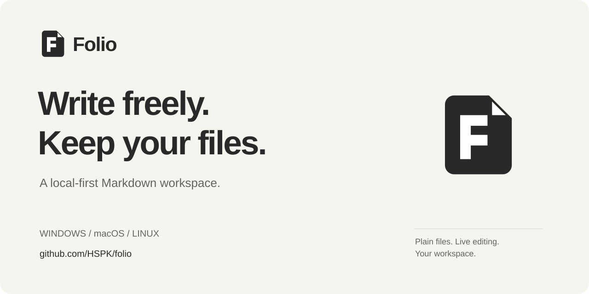
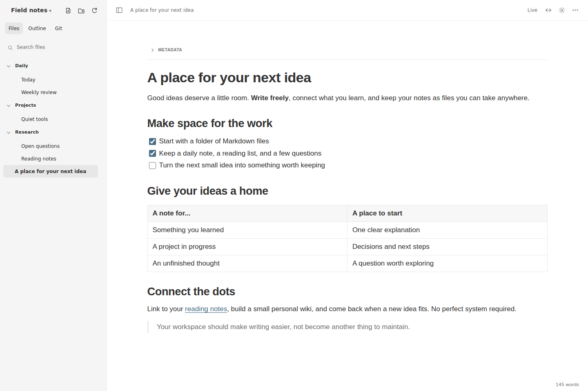
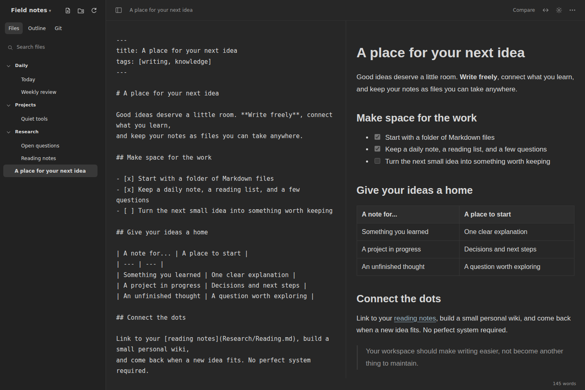

<p align="center">
  
</p>

<p align="center">
  <a href="https://github.com/HSPK/folio/releases"></a>
  <a href="LICENSE"></a>
  <a href="https://github.com/HSPK/folio/releases"></a>
</p>

<p align="center">
  <strong>English</strong> · <a href="README.zh-CN.md">简体中文</a><br>
  <a href="https://hspk.github.io/folio/">Website</a> ·
  <a href="#install">Install</a> ·
  <a href="https://github.com/HSPK/folio/releases">Downloads</a> ·
  <a href="https://github.com/HSPK/folio/issues">Feedback</a>
</p>

# Folio

**Write freely. Keep your files.**

Folio is an open-source, local-first Markdown workspace for writing, research and personal knowledge.
Open a folder, edit directly in a formatted page, and keep your notes as ordinary `.md` files.
Use them with Git, a text editor or your own backup tools — no proprietary notebook to export.

A small Rust service and native Windows/macOS launchers open the editor in **your existing browser**.
Linux uses a CLI. No bundled browser engine, mandatory hosted account or subscription service.



## Why Folio?

| What you need | What Folio offers |
| --- | --- |
| A quiet place to write | **Live** editing, an outline, a collapsible sidebar and light/dark themes. |
| Control over the source | **Source**, side-by-side **Compare**, and read-only **Read** views. |
| A connected knowledge base | Full-text search, YAML tags, wiki links, backlinks and favorites. |
| Fewer lost drafts | Version history, a recycle bin, local recovery and external-change conflict checks. |
| A shared workspace when you want one | Projects, page permissions, public links and real-time collaboration. |
| Notes that work with Git | Review diffs, stage and commit; optional scheduled commit-and-push. |

Tables, task lists, code blocks, editable LaTeX math, note templates and image paste/drop are built in.
You can keep writing alone, or explicitly share a project or page; collaboration is not forced on every document.

<details>
<summary><strong>See Markdown source and preview together</strong></summary>



The same file, two perspectives. Use Source when you need precise syntax control; use Live when you want to focus on the page.
</details>

## Install

Current release: **[0.1.0](https://github.com/HSPK/folio/releases/tag/v0.1.0)**.
Windows, macOS and Linux packages are available for **x64 and ARM64**.

**Linux / macOS**

```sh
curl -fsSL https://github.com/HSPK/folio/releases/latest/download/install.sh | sh
```

**Windows PowerShell**

```powershell
irm https://github.com/HSPK/folio/releases/latest/download/install.ps1 | iex
```

The installers choose the correct architecture, check the archive's SHA-256 and install for the current user.
No administrator privileges are required. Prefer to inspect scripts first? Read [install.sh](install.sh) or
[install.ps1](install.ps1), or download an archive and `SHA256SUMS` from [Releases](https://github.com/HSPK/folio/releases).
The checksum detects mismatched downloads; it is not a separate publisher signature.

| Platform | Installed to | Start |
| --- | --- | --- |
| Windows | `%LOCALAPPDATA%\Programs\Folio` | Open **Folio** from the Start Menu. |
| macOS | `~/Applications/Folio.app` | Open **Folio** from Applications. |
| Linux | `~/.local/bin/folio` | Run `folio --serve /path/to/markdown`. |

On Linux, add `~/.local/bin` to your `PATH` if needed. On macOS, releases are **ad-hoc signed, not notarized**;
the first launch may require approval in **System Settings → Privacy & Security**. The installer does not disable Gatekeeper.

<details>
<summary>Pin a version or choose an installation directory</summary>

```sh
curl -fsSL https://github.com/HSPK/folio/releases/download/v0.1.0/install.sh |
  FOLIO_VERSION=0.1.0 FOLIO_INSTALL_DIR="$HOME/.local/bin" sh
```

```powershell
$env:FOLIO_VERSION = "0.1.0"
$env:FOLIO_INSTALL_DIR = "$env:LOCALAPPDATA\Programs\Folio"
irm https://github.com/HSPK/folio/releases/download/v0.1.0/install.ps1 | iex
```

On macOS, `FOLIO_INSTALL_DIR` is the parent directory for `Folio.app`.
Save your work and exit the old application before updating.
</details>

## Your first minute

1. **Open a Markdown folder.** Launch Folio on Windows/macOS and choose your directory, or run the Linux command above.
2. **Create your local administrator.** The first browser visit sets up a username and password on your own service — not a Folio cloud account.
3. **Write.** Open an existing note or create one; Live edits the formatted page and saves automatically. Switch to Source whenever you need the raw Markdown.

Try **Ctrl/Cmd+P** for search, type `/` in an empty Live paragraph for blocks, and use **Ctrl/Cmd+S** to save immediately.

## Local-first, with clear boundaries

- **The notes are files.** Markdown and attachments live in folders. Accounts, indexes, history and collaboration state use separate local storage; include it in your backups if you want those features preserved.
- **Private by default.** The service binds to `127.0.0.1`. Sharing requires explicit permissions and an address the recipient can actually reach.
- **Not a hosted sync service.** Folio does not set up public hosting, TLS or cross-device connectivity. Git sync is opt-in and needs your own repository and credentials.
- **Source stays available.** Merely opening a document does not rewrite it. Live edits can normalize Markdown syntax; use Source for byte-level control.

Folio is **early-stage software**. Back up important notes and review changes before enabling automatic Git pushes.
Single notes currently have a 4 MiB limit; file listings have a 5,000-note limit.
See the [detailed Chinese guide](docs/guide.zh-CN.md) for behavior, limits, networking and migration from the previous application name.

## Built with care, open to contributions

One Rust core powers the native launchers and the browser workspace. The reusable editor package,
[`@folio/editor`](web/editor/README.md), uses Milkdown, CodeMirror and KaTeX; collaboration uses Yjs/Yrs.
Browser assets are shipped with the application rather than fetched from a runtime CDN.

```sh
cargo build --locked --release -p folio-cli --target-dir build/rust
./build/rust/release/folio-core --serve /path/to/markdown
```

For frontend changes, use Node.js 22+:

```sh
npm --prefix web ci
npm --prefix web run build
npm --prefix web test
```

See [CONTRIBUTING.md](CONTRIBUTING.md) for focused contributions, platform builds and tests.
Found a rough edge? [Report a bug](https://github.com/HSPK/folio/issues/new/choose) or
[suggest an improvement](https://github.com/HSPK/folio/issues/new/choose).
If Folio fits your workflow, a star or a link to someone who writes in Markdown helps people discover it.

## License

[MIT](LICENSE) · Created by [HSPK](https://github.com/HSPK).
Bundled dependencies retain their own licenses; see [third-party notices](web/public/THIRD-PARTY-LICENSES.txt).

Want to introduce Folio to your community? Use the [bilingual press kit](docs/press-kit.md) for screenshots,
short descriptions and ready-to-adapt launch copy.
